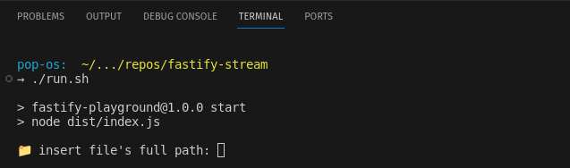

boilerplate implementation for consuming axios stream on fastify post route

---

 

#### dependencies:

- docker
- docker-compose
- node ^18

---

 

#### usage:

- run `prepare.sh` for bootstraping and turning the server on
- run `run.sh` to spin up the client's prompt

---

 

---
